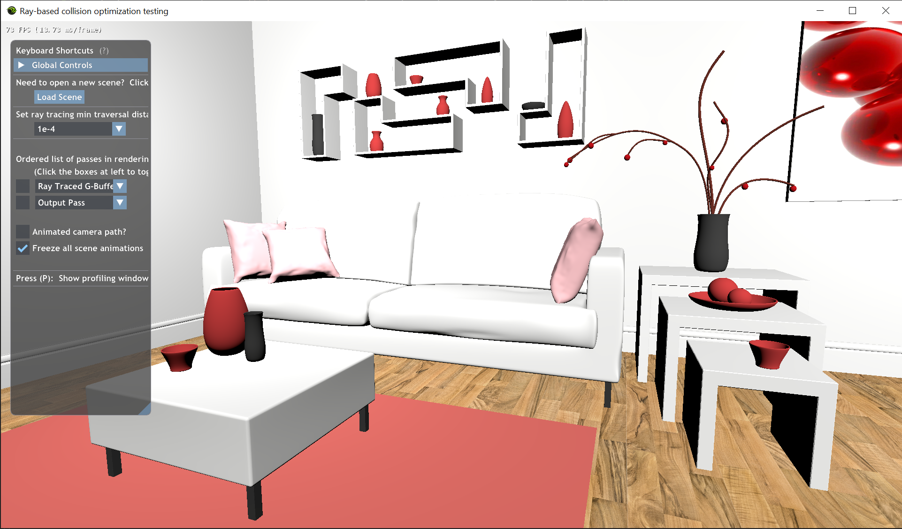

# RaytraceCollisions
Recycling rays between raytrace rendering and volumetric collisions on RTX cards

#### Recommended Setup:
- Windows 10 RS5, along with Windows 10 SDK 10.0.17763.0
- Visual Studio 2017
- A graphics card that supports NVIDIA raytracing. The NVIDIA driver should be above 416.xx

#### Progress Images:
Week 1: Project setup, realtime raytraced scene with basic phong diffuse shading 

